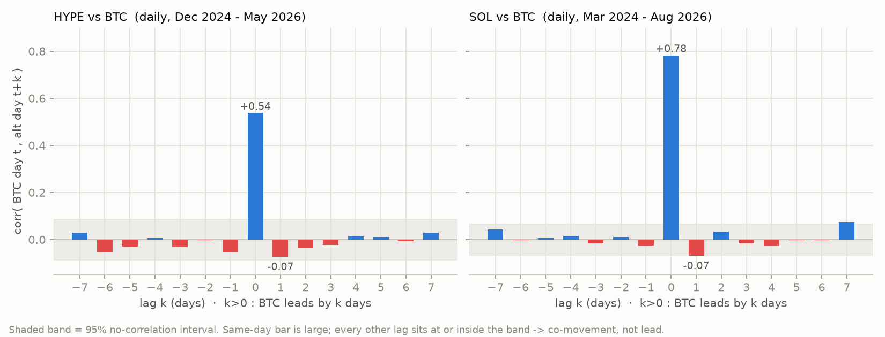
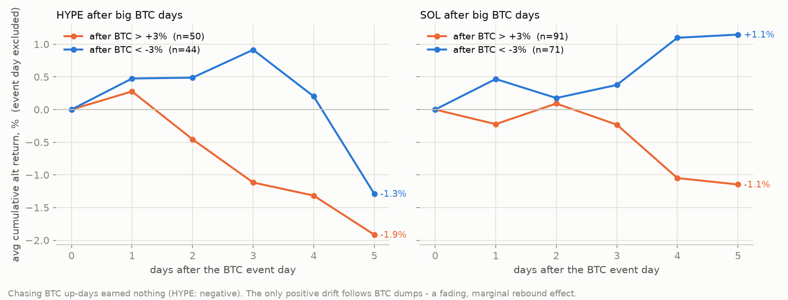
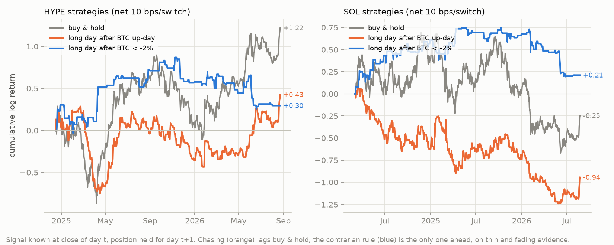
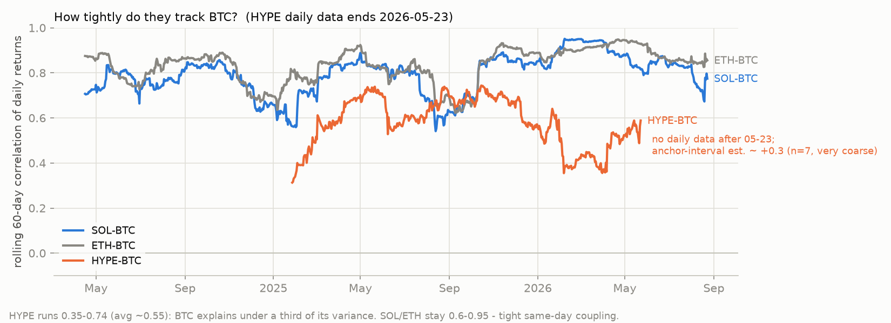

# BTC 能否作为 HYPE / LIT / SOL 的先导指标？—— 日频 Lead-Lag 与 Alpha 实证

**问题**：以 BTC 为先导信号买入 HYPE、LIT（Lighter）、SOL，这些币的价格反应在时间上是否落后于 BTC（存在可利用的时间差）？该做法有没有 Alpha？

**研究日期**：2026-08-23 · 数据截至：SOL/BTC 2026-08-23，HYPE 2026-05-23，LIT 仅稀疏锚点

---

## TL;DR

1. **日频及以上不存在"BTC 先动、山寨后补"的正向领先**。BTC 与 SOL/HYPE 是同日强联动（同日相关 SOL 0.78、HYPE 0.54、ETH 0.83），而 BTC 对次日山寨收益的相关全部为**零或轻微负值**（lag+1：SOL −0.07、HYPE −0.08）。等你在日线上看到 BTC 的信号时，山寨当天已经同步走完了。
2. **"BTC 涨了追买山寨"在 2024-2026 年是负 Alpha**。BTC 上涨日次日做多 HYPE 的规则相对买入持有的年化 Alpha 约 **−40%**；BTC 单日 +3% 后 HYPE 未来 3 天平均 **−2.6%**（追高被兑现）。SOL 同类规则全部跑不赢持有。
3. **统计上唯一勉强显著的信号方向是逆向的**：BTC 单日 **−3%** 之后，HYPE 未来 1 天 +2.5%（t≈2.5）、3 天 +4.2%（t≈2.2）——超跌反弹，不是动量传导。且该效应在后半样本已衰减（+1.2%，t≈0.9），不足以作为可靠策略。
4. **2020-21 年确实存在的 2-3 日 / 1-2 周正向传导已经消失**。SOL 长样本（2020-04 起）中 lag 2-3 日相关 +0.05~+0.07（t≈2-3）、周频 lag+1 周 +0.17（t=3.1）均显著——但拆分子样本后全部集中在前半段（2020-2023），2024-26 年为零甚至反号。市场效率已把这个时间差抹掉。
5. **月度"轮动"故事不可靠、方向因资产而异**：过去 21 天 BTC 强 → 未来 21 天 HYPE 相对 BTC 跑赢（t=2.3）但 **SOL 同期反而显著跑输**（t=−3.2）。同一时期两个币方向相反，说明这不是"BTC 先导"规律，而是各自的叙事强弱。
6. **持有山寨获得的是放大且不对称的 Beta，不是 Alpha**：SOL 下行 Beta 1.39 > 上行 1.06，ETH 1.37 > 1.11——BTC 跌的时候跟得更狠，涨的时候跟得少。
7. **HYPE 与 LIT 的主导因素是自身叙事而非 BTC**：HYPE 与 BTC 的 60 日相关仅 0.35-0.74（BTC 只解释其方差的 ~29%），2026 年 6 月起在 BTC 下跌时因 ETF 叙事逆势上涨（彭博/CNBC 报道）；LIT 上线 8 个月内的各阶段与 BTC 幅度脱节甚至反号（2026-05→08：LIT +88% / BTC −15%）。用 BTC 择时这两个币，噪音远大于信号。
8. **真正的领先只存在于分钟级**，属于高频套利者；日线数据既测不到、人工也吃不到。

**一句话**：BTC 日线信号对这三个币没有"时间差"可赚；追涨是负 Alpha，弱证据反而支持大跌后的短线逆向。山寨相对 BTC 提供的是不对称放大的 Beta + 巨大的个体风险。

---

## 1. 数据与构建

受限环境下可用的两条独立数据通道，互为交叉验证：

| 面板 | 来源 | 品种与窗口 | 时间戳约定 |
|---|---|---|---|
| CM 面板 | [Coin Metrics community data](https://github.com/coinmetrics/data)（GitHub 镜像，更新至 2026-05-24） | BTC/ETH（PriceUSD，2019 起）；SOL/HYPE（CapMrktEstUSD 反推，SOL 2020-04 起、HYPE 2024-12-13 起）→ 2026-05-23 | 当日收盘（00:00 UTC 次日） |
| API 面板 | [`@fawazahmed0/currency-api`](https://www.npmjs.com/package/@fawazahmed0/currency-api) npm 每日快照（904 版，无缺口） | BTC/ETH/SOL，2024-03-02 → 2026-08-23 | ~00:00-02:00 UTC 同一快照 |
| LIT | Coin Metrics `lit_lighter` + 公开报价页锚点 | 仅 7 个日度价格（2026-05-18..24）+ 成交量史 + 6 个稀疏锚点 | — |

**关键数据工程结论**（`build_dataset.py` 有完整记录）：

- Coin Metrics 社区 CSV 只对 BTC/ETH 保留完整 `PriceUSD`；SOL/HYPE 只能用 `CapMrktEstUSD`。实证验证它等于**分段常数的流通量估计 × 当日收盘价**（BTC 隐含流通量恒为 19.87M、日变化 0.002%；HYPE 对已公布参考价的隐含流通量恒为 238.4M），因此其对数差分就是收盘价日收益——只在罕见的"流通量估计修订日"出现一次性跳变。检测并剔除了一个修订日（2025-08-28：−23.8% vs BTC +1.1%，无任何行情佐证，前一日 $51、三周后创新高）。
- npm 快照面板中 BTC 与 SOL 出自同一文件同一时刻，**配对内部时间一致**——这是 lead-lag 检验的前提（跨源配对会因固定时差伪造出领先性）。2025-12-06 一版汇率损坏，剔除。
- 跨源校验：BTC 日收益两源相关 0.91（快照采样抖动所致，同快照内为共同噪声，不产生虚假先后）；SOL 市值反推收益 vs 快照收益相关 0.92，与 BTC 跨源水平相同，说明反推无额外失真。
- **LIT 指 Lighter**（zk-rollup 永续 DEX 的代币，2025-12-30 TGE + 25% 空投），不是 Litentry（Coin Metrics 中另有 `lit`，价格 $0.066 量级）。Lighter 在两条通道中都没有完整日线，只能做描述性分析。

**配对原则**：BTC↔HYPE 用 CM 面板（同为收盘约定），BTC↔SOL 用 API 面板（最新、同快照），长样本稳健性用 CM 面板，ETH 作对照。

## 2. 方法

对每个配对（日频对数收益）：同日相关与 Beta（HAC-t）→ ±7 日交叉相关 CCF（95% 置信带 ±1.96/√n）→ 双向 Granger 因果（lag 1-5）→ 预测回归 `alt(t+1) ~ btc(t) + alt(t)`（Newey-West）→ 事件研究（BTC ±2%/±3% 日后 1/2/3/5 天，剔除事件日）→ 六条可执行规则回测（信号在 t 日收盘已知、持有 t+1 日，0/10/20bps 换手成本，Alpha 用日度回归对买入持有取残差）→ 周频 CCF 与 21 天"轮动"回归 → 子样本拆半稳健性。

## 3. 结果

### 3.1 同日联动强，跨日领先为零



同日柱（+0.54 / +0.78）一柱独大；**其余所有 lag 都贴在零附近或置信带内，且 lag+1 为负**。Granger "btc→alt" 在 lag1-2 的边际显著（HYPE p=0.049、SOL p=0.039-0.06）方向上是**负系数**（HYPE：btc(t) 系数 −0.24，t=−1.7）——是轻微的次日均值回归，不是跟涨传导。反向（alt→btc）全不显著。

### 3.2 事件研究：追涨为负、大跌后反弹



| 事件 | n | HYPE 同日 | HYPE +1d | HYPE +3d | SOL +3d |
|---|---|---|---|---|---|
| BTC > +3% | 37/91 | +6.2% | −0.8% | **−2.6% (t=−1.9)** | −0.2% |
| BTC < −3% | 45/71 | −5.1% | **+2.5% (t=+2.5)** | **+4.2% (t=+2.2)** | +0.4% |

同日一列就是 Beta：事件当天已经跟完。次日起，追涨方向为负、大跌后为正。逆向效应剔除可疑数据日后仍在（t≈2.3），但**后半样本衰减到 +1.2%（t=0.9）**，且 45 个事件的样本不大——只能算"暗示性"，不是可靠 Alpha。

### 3.3 回测：所有追涨规则 ≤ 买入持有



HYPE（2024-12→2026-05，B&H 累计对数收益 +1.00）：

| 规则（信号→次日持仓） | 毛收益 | Sharpe | 年化 Alpha vs B&H | 净 10bps |
|---|---|---|---|---|
| BTC 上涨日后做多 | −0.15 | −0.15 | **−40%** (t=−0.9) | −0.41 |
| BTC>+2% 后做多 | +0.35 | +0.54 | +12% (t=0.3) | +0.21 |
| BTC 符号多空 | −1.08 | −0.72 | −67% (t=−0.8) | −1.60 |
| BTC 3 日动量 | −0.06 | −0.06 | −33% (t=−0.7) | −0.21 |
| **BTC<−2% 后做多（逆向）** | **+1.21** | **+1.62** | +67% (t=1.7) | +1.07 |

SOL（2024-03→2026-08，B&H −0.24）：同构，追涨规则 −0.50~+0.12，逆向 +0.44（t=1.0）。唯一在费后仍为正、且方向一致的只有**逆向**规则——但 t 值 1.0-1.7，达不到显著，且已在衰减。

### 3.4 周频与月度"轮动"检验

- 周频 CCF lag+1 周：HYPE −0.04、SOL −0.01、ETH +0.06——全不显著。**"BTC 先涨一周、山寨下周补涨"在近两年不存在。**
- 21 天轮动回归（过去 21 天 BTC → 未来 21 天山寨相对 BTC）：HYPE +0.69（t=2.3，BTC 强月后 HYPE 相对跑赢 +14%）；**SOL −0.28（t=−3.2，BTC 强月后 SOL 相对跑输 −6%）**。同期两币方向相反 → 这是各自叙事（HYPE 是 2025-26 的结构性赢家）而非 BTC 先导规律。
- 长样本（2020-04 起）里轮动为正（+0.77，t=2.6，Q4 +23%）、周频 lag+1 也显著（+0.17，t=3.1）——**旧时代真实存在的传导，2024-26 已消失**。

### 3.5 Beta 不对称与相关性时变



| | 上行 Beta | 下行 Beta | 60 日滚动相关区间 |
|---|---|---|---|
| SOL | 1.06 | **1.39** | 0.54-0.95（现值 ~0.77） |
| ETH | 1.11 | **1.37** | 0.62-0.95 |
| HYPE | 0.96 | 1.06 | **0.35-0.74**（现值 ~0.59） |

拿 SOL/ETH 换取的是**下行放大更多**的 Beta。HYPE 与 BTC 的相关只有一半：BTC 解释其方差的 ~29%，其余 71% 是自身因素（CFTC/合规消息 2026-01-27 单日 +21%、二月解锁 ~9.9M 枚、HyperEVM、回购，2026 年 6 月更在 BTC 下跌中因 ETF 叙事逆势入市值前十——见文末来源）。

### 3.6 LIT（Lighter）：无法做统计检验，锚点显示与 BTC 高度脱节

可得数据只有 7 个日度价格 + 6 个锚点：

| 阶段 | LIT | BTC 同期 |
|---|---|---|
| 2025-12-30 TGE → 2026-03-31 | **−81%**（$4.04 → $0.78） | −22% |
| 2026-03-31 → 05-18 | +11% | +13% |
| 2026-05-18 → 05-24 | **+41%** | −0.4% |
| 2026-05-24 → 08-10 | **+88%** | **−15%** |
| 2026-08-11 → 08-23 | +35%（→ ~$3.3） | +20% |

7 天日度窗口内 LIT 单日 ±9~20% 对应 BTC ±0.4~3%。空投抛压 → 缩量筑底 → 回购燃烧叙事反转，几乎每一段都与 BTC 脱节甚至反向。**对上线 <1 年、流通盘和筹码结构剧烈变化的新币，BTC 择时信号基本失效**；HYPE 上线头 9 个月的样本同样支持这一点（其逆向反弹效应也集中在早期高波动阶段）。

## 4. 稳健性与告诫

- HYPE 收益经由市值列反推（方法验证见 §1），已剔除 1 个确认的修订日；把两个存疑日（2026-02-04/06）一并剔除后结论不变（逆向 t 从 2.55→2.32）。
- 逆向效应或有事件聚集（2025Q1 与 2026Q1 各占 13/12 个事件）与重叠窗口问题，t 值略有高估；拆半后后半段不显著。
- 本文检验了 6 条规则 × 多个配对，存在多重检验问题——越发不应把 t≈1.7-2.5 的结果当成实盘依据。
- **HYPE 为何缺 2026-05-24 之后的日线**：三层原因叠加。① 本分析环境的出口网络为白名单制，所有行情 API（Binance/Coinbase/CoinGecko/CryptoCompare/CoinPaprika/DefiLlama/GeckoTerminal/KuCoin/Gate/MEXC/Bitget/Hyperliquid/Lighter 官方 API、Yahoo、Wayback、HuggingFace 等 40+ 端点实测全部被 403 拦截）；② 唯二可达的批量数据源各有缺口——Coin Metrics 的 GitHub 仓库只是镜像，**其每日 CI 实际推送到 GitLab 私有库 `coinmetrics/data-delivery/data`，GitHub 镜像同步在 2026-05-24 后中断**（经 `git ls-remote` 复核，master 仍停在该日；GitLab 正主库匿名 401 不可读）；③ npm 的 `@fawazahmed0/currency-api` 虽每日更新至今，但币种表冻结于 2024 年初（341 个），无 hype/lit。
- 作为补救，用 web 检索核实的价格锚点把 HYPE 缺失窗口延伸如下（BTC 腿来自本文 API 面板日线，见 `data/hype_anchor_points.csv`）：

| 区间 | HYPE | BTC 同期 | 备注 |
|---|---|---|---|
| 05-24 → 06-03 | **+22%** | **−16%** | 单日 +22% 冲进市值前十（Bloomberg），BTC 同期下挫——完全反向 |
| 06-03 → 06-16 | +7% | +2% | 创旧 ATH ~$76.8 |
| 06-16 → 07-15 | −6% | −2% | 测试 ATH，现货 HYPE ETF 累计流入 ~$170M |
| 07-15 → 08-16 | **−22%** | −2% | 自身回撤至 $56，BTC 几乎未动 |
| 08-16 → 08-21 | **+38%** | +24% | Trump/CFTC 合规表态，双双拉升、HYPE 放大，新 ATH $77.62 |

  这段锚点定量印证了正文结论：2026 年 6-8 月 HYPE 由自身叙事驱动（ETF、合规进展），与 BTC 多段反向或倍数放大——纳入日线只会进一步压低 BTC 的解释力，强化"BTC 不是 HYPE 先导"的结论。锚点区间相关 ≈ **+0.30**（n=7，95% CI [−0.59, +0.86]，区间长短不一、仅供方向参考），低于缺口前 60 日滚动相关的区间下限 0.35。
- **补全通道**：60 日滚动相关必须逐日收益才能计算，锚点无法（也不应）插值成日线。在不受网络限制的机器上运行 `python fetch_hype_extension.py` 生成 `data/hype_daily_extension.csv`（或用任何行情源自制该文件：每日一行，列为 `date,hype_usd`，~00:00 UTC 价），`btc_leadlag_analysis.py` 与 `make_figures.py` 检测到该文件后会自动把 HYPE–BTC 配对统计和滚动相关图续到最新。
- 分钟级的 BTC→山寨领先在文献与实务中存在但衰减极快（秒-分钟级、由高频做市与套利收敛），日线数据无法检验，也不构成人工可执行的策略。
- 本文为历史统计描述，不构成投资建议。

## 5. 实践含义

1. 想要"BTC 涨了再上车山寨吃时间差"——**这个时间差在日线级别不存在**，2021 年那种隔日/隔周补涨已被套利掉。
2. 若一定要用 BTC 信号操作这三个币，历史证据（弱）支持的方向是**大跌后的短线逆向**，不是追涨；且需接受该效应正在衰减、费后余量有限。
3. 持有 SOL/ETH 相对 BTC 的差异主要是**不对称 Beta**（下行 1.4 倍）；持有 HYPE/LIT 则主要暴露于**其自身基本面/筹码叙事**（收入回购、解锁、ETF/合规进展、空投消化），应当按各自基本面而非 BTC 图形来定仓位与时点。

## 复现

```bash
# 1) 数据（需能访问 github.com 与 registry.npmjs.org）
git clone --depth 1 https://github.com/coinmetrics/data coinmetrics-data
# 每日快照：对每个版本 v（2024.3.2 .. 今天）
#   curl .../@fawazahmed0/currency-api/-/currency-api-$v.tgz | tar xzO package/v1/currencies/btc.min.json > snap/$v.json
python build_dataset.py --cm-clone coinmetrics-data --snapshot-dir snap

# 2) 分析与图表
python btc_leadlag_analysis.py     # -> results.json + 控制台摘要
python make_figures.py             # -> figures/*.png
```

### 外部事实来源（经 web 检索核实）

- Lighter LIT 上线与空投：[CoinDesk 2025-12-30](https://www.coindesk.com/markets/2025/12/30/lighter-dex-launches-lit-token-with-25-airdrop)；LIT 现价/ATH/ATL：[CoinMarketCap](https://coinmarketcap.com/currencies/lighter/)、[CoinGecko](https://www.coingecko.com/en/coins/lighter)、[OKX](https://www.okx.com/en-us/price/lighter-lit)
- HYPE 2026-01-27 单日 +27%（CFTC 合规路径）：[CryptoTicker](https://cryptoticker.io/en/hyperliquid-hype-price-70-breakout-target/)
- HYPE 2026 年 6 月与 BTC 脱钩：[Bloomberg 2026-06-03](https://www.bloomberg.com/news/articles/2026-06-03/a-180-crypto-rally-shows-new-investing-era-as-bitcoin-stumbles)、[CNBC 2026-06-06](https://www.cnbc.com/2026/06/06/bitcoin-price-crash-crypto-hype-hyperliquid-etfs.html)
- HYPE 2025 年 8-9 月价格路径（8/27 $50.99、9/18 ATH $59.30）：[TradingView/Coinpedia](https://coinpedia.org/price-analysis/hyperliquid-hype-price-outlook-rally-to-60-or-crash-to-20-next/)
